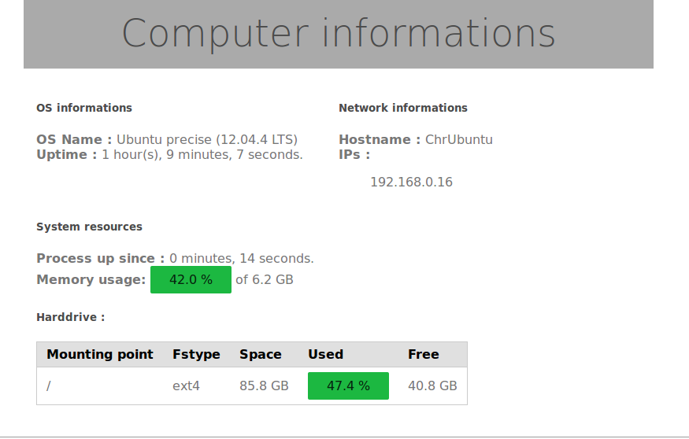

# PiSysInfo

Display a page that lists information about the computer ( hostname, ips, hard drive, ... )

Use [PureCSS](http://purecss.io/) for presentation

Screenshot : 

Under [BSD license](https://raw.github.com/nioto/PiCamStreamer/master/LICENSE)

